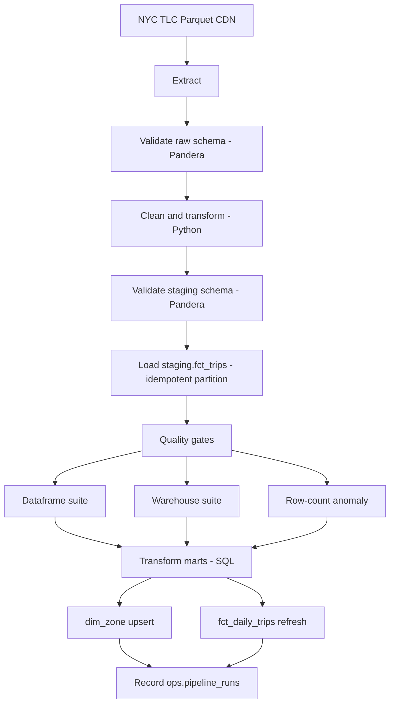

# NYC Taxi ETL Pipeline

A production-style ETL pipeline for the public [NYC TLC yellow taxi trip dataset](https://www.nyc.gov/site/tlc/about/tlc-trip-record-data.page). The same Python core powers **two orchestrators** (Apache Airflow and Dagster), loads data into a layered Postgres warehouse, and enforces schema validation, multi-step quality checks, and row-count anomaly detection on every run.

**Repository:** [github.com/saanikapatil08/NYC-Taxi-ETL](https://github.com/saanikapatil08/NYC-Taxi-ETL)

---

## Table of contents

- [What this project does](#what-this-project-does)
- [Verified results (local run)](#verified-results-local-run)
- [Tech stack](#tech-stack)
- [Project flow](#project-flow)
- [Data warehouse layers](#data-warehouse-layers)
- [Repository layout](#repository-layout)
- [Prerequisites](#prerequisites)
- [Quick start](#quick-start)
- [Run the pipeline](#run-the-pipeline)
- [Verify data in Postgres](#verify-data-in-postgres)
- [Unit tests](#unit-tests)
- [CI on GitHub](#ci-on-github)
- [Configuration](#configuration)
- [Production controls](#production-controls)
- [Troubleshooting](#troubleshooting)
- [Stop and reset](#stop-and-reset)

---

## What this project does

| Capability | Detail |
|------------|--------|
| **Source** | Monthly Parquet files from NYC TLC (`yellow_tripdata_YYYY-MM.parquet`) |
| **Orchestration** | Same logic in **Airflow** (`nyc_taxi_etl` DAG) and **Dagster** (partitioned assets) |
| **Warehouse** | Postgres with `raw` → `staging` → `marts` → `ops` schemas |
| **Validation** | Pandera schemas on raw and staging data |
| **Quality** | Dataframe checks, warehouse checks, row-count anomaly vs 6-month median |
| **Reliability** | Retries with exponential backoff, idempotent partition loads, Slack/log alerts |
| **Monitoring** | Airflow `nyc_taxi_monitoring` DAG + Dagster run-health sensor |

Swapping Airflow for Dagster (or the reverse) does **not** change business rules—all shared code lives under `shared/`.

---

## Verified results (local run)

These numbers were produced on a successful end-to-end run (Docker Compose + pipeline trigger for March partitions).

### Unit tests

| Metric | Result |
|--------|--------|
| Test suite | **22 passed** |
| Command | `PYTHONPATH=. python -m pytest -ra` |
| Python | 3.9.25 (use 3.9–3.12 locally; avoid 3.14 for `requirements-ci.txt`) |

### Staging (`staging.fct_trips`)

| trip_year | trip_month | row_count |
|-----------|------------|-----------|
| 2024 | 3 | **3,034,499** |
| 2026 | 3 | **2,890,935** |

Row counts are in line with typical NYC yellow-taxi volume (~3M trips per month).

### Marts (after transform)

| Table | Row count | Description |
|-------|-----------|-------------|
| `marts.fct_daily_trips` | **6,831** | Daily aggregates by pickup zone |
| `marts.dim_zone` | **261** | Distinct pickup/dropoff zones |

### Services (local Docker)

| Service | URL / port |
|---------|------------|
| Airflow UI | http://localhost:8080 (`admin` / `admin`) |
| Dagster UI | http://localhost:3000 |
| Warehouse Postgres | `localhost:5432` (user/db/password: `taxi`) |

---

## Tech stack

- **Python 3.10+** (Docker images use 3.10; local tests work on 3.9–3.12)
- **pandas**, **pyarrow**, **Pandera**, **SQLAlchemy**, **psycopg2**
- **Apache Airflow 2.9.3** and **Dagster 1.8.7**
- **PostgreSQL 15** (warehouse + separate Airflow metadata DB)
- **Docker Compose** for local full stack
- **GitHub Actions**: ruff, black, pytest, Airflow DAG parse check

---

## Project flow

End-to-end path from source file to analytics tables:



### Stage-by-stage (same order in Airflow and Dagster)

| # | Stage | What happens |
|---|--------|----------------|
| 1 | **Init warehouse** | Runs all `sql/ddl/*.sql` files; safe on empty Postgres |
| 2 | **Extract** | Downloads monthly Parquet with retries (`tenacity`); skips if file already exists |
| 3 | **Validate raw** | Pandera check on source columns before load |
| 4 | **Clean & load staging** | Python cleaning rules → staging schema → replace `(trip_year, trip_month)` partition |
| 5 | **Quality gates** | See [Quality validation](#quality-validation) |
| 6 | **Transform marts** | SQL: `dim_zone.sql`, `fct_daily_trips.sql` for the partition |
| 7 | **Record metrics** | Inserts run metadata into `ops.pipeline_runs`; anomaly history in `ops.row_count_history` |

**Airflow task graph:** `init` → extract → load → quality (parallel checks) → transform → record  

**Dagster asset graph:** `raw_trip_file` → `cleaned_trips` → `staging_trips_loaded` → checks / `dim_zone_refreshed` → `fct_daily_trips_refreshed`

---

## Data warehouse layers

```
postgres (database: taxi)
├── raw          # optional landing (DDL present)
├── staging      # cleaned trip facts
│   └── fct_trips
├── marts        # analytics-ready
│   ├── dim_zone
│   └── fct_daily_trips
└── ops          # operations & monitoring
    ├── pipeline_runs
    └── row_count_history
```

**Partitioning:** Loads are idempotent per `(trip_year, trip_month)`—re-running a month deletes that partition in staging before reload, so retries do not duplicate rows.

---

## Repository layout

```
NYC-Taxi-ETL/
├── shared/                 # Core ETL logic (used by Airflow + Dagster)
│   ├── extract.py          # Parquet download
│   ├── transform.py        # Cleaning rules
│   ├── schema.py           # Pandera raw/staging schemas
│   ├── quality_checks.py   # Dataframe + warehouse suites
│   ├── anomaly.py          # Row-count anomaly detector
│   ├── load.py             # DDL bootstrap, staging load, SQL transforms
│   ├── alerts.py           # Slack + structured logging
│   └── config.py           # Environment-driven settings
├── sql/
│   ├── ddl/                # Schema creation (raw, staging, marts, ops)
│   └── transformations/    # dim_zone, fct_daily_trips, row-count record
├── airflow/
│   ├── dags/nyc_taxi_etl.py      # Main production DAG
│   ├── dags/monitoring.py        # Daily anomaly backfill DAG
│   └── plugins/callbacks.py      # Failure / retry / SLA alerts
├── dagster_project/
│   └── nyc_taxi/           # Assets, checks, jobs, sensors, partitions
├── tests/                  # 22 pytest tests
├── docker-compose.yml      # Postgres + Airflow + Dagster
├── requirements.txt        # Full stack (Airflow + Dagster)
├── requirements-ci.txt     # Lean deps for tests/CI
└── .github/workflows/ci.yml
```

---

## Prerequisites

1. **Docker Desktop** — running (for full pipeline)
2. **Git**
3. **Python 3.9–3.12** — for local unit tests only  
   - macOS default `python3` may be **3.14**, which cannot install `dagster==1.8.7`  
   - Use Homebrew: `/opt/homebrew/bin/python3.9 -m venv .venv`

---

## Quick start

### 1. Clone and configure

```bash
git clone https://github.com/saanikapatil08/NYC-Taxi-ETL.git
cd NYC-Taxi-ETL
cp .env.example .env
```

Edit `.env` only if you need custom ports or Slack alerting. Defaults work for local Docker.

### 2. Start the stack

```bash
docker compose up -d --build
```

Wait until containers are healthy (first run can take several minutes).

| Container | Role |
|-----------|------|
| `taxi-postgres` | Warehouse |
| `airflow-meta` | Airflow metadata DB |
| `airflow-web` / `airflow-sched` | Airflow UI + scheduler |
| `dagster-web` / `dagster-daemon` | Dagster UI + sensors |

### 3. Run tests (optional, no Docker)

```bash
/opt/homebrew/bin/python3.9 -m venv .venv   # or python3.11 / 3.12
source .venv/bin/activate
pip install -r requirements-ci.txt
PYTHONPATH=. python -m pytest -ra
```

Use `python -m pytest` (not bare `pytest`) so the virtualenv is used.

---

## Run the pipeline

Pick **one** orchestrator per month—you do not need both for the same partition.

### Option A — Airflow

1. Open http://localhost:8080 and log in with `admin` / `admin`
2. Enable DAG **`nyc_taxi_etl`** if it is paused
3. **Trigger DAG w/ config** and pass JSON:

```json
{"year": 2024, "month": 3}
```

4. Open the run → **Graph** view and watch tasks complete

**Monitoring DAG:** `nyc_taxi_monitoring` scans recent partitions daily for silent row-count regressions.

### Option B — Dagster

1. Open http://localhost:3000
2. Open the **`nyc_taxi`** asset graph
3. Select monthly partition **`2024-03-01`**
4. Click **Materialize selected**

Asset checks in the UI mirror the shared quality suites (warnings may show without failing the run).

---

## Verify data in Postgres

```bash
# Staging row counts by partition
docker exec -it taxi-postgres psql -U taxi -d taxi -c \
  "SELECT trip_year, trip_month, COUNT(*) FROM staging.fct_trips GROUP BY 1,2 ORDER BY 1,2;"

# Marts
docker exec -it taxi-postgres psql -U taxi -d taxi -c \
  "SELECT COUNT(*) AS daily_trip_rows FROM marts.fct_daily_trips;"
docker exec -it taxi-postgres psql -U taxi -d taxi -c \
  "SELECT COUNT(*) AS zones FROM marts.dim_zone;"

# Recent pipeline runs
docker exec -it taxi-postgres psql -U taxi -d taxi -c \
  "SELECT pipeline, status, trip_year, trip_month, started_at
   FROM ops.pipeline_runs ORDER BY started_at DESC LIMIT 10;"
```

**Example output (staging):**

```
 trip_year | trip_month |  count
-----------+------------+---------
      2024 |          3 | 3034499
```

---

## Unit tests

| File | Covers |
|------|--------|
| `test_transform.py` | Cleaning rules (fares, durations, zones) |
| `test_schema.py` | Pandera raw/staging validation |
| `test_quality.py` | Dataframe and warehouse check suites |
| `test_anomaly.py` | Anomaly detector (floor, deviation, no history) |
| `test_alerts.py` | Alert sender with/without Slack webhook |
| `test_dagster_definitions.py` | Dagster assets, jobs, sensors load |

```bash
source .venv/bin/activate
PYTHONPATH=. python -m pytest -ra
```

Expected: **`22 passed`**

---

## CI on GitHub

On every push to `main`, [GitHub Actions](https://github.com/saanikapatil08/NYC-Taxi-ETL/actions) runs:

| Job | Checks |
|-----|--------|
| `lint-and-test` | `ruff check .`, `black --check .`, `pytest -ra` |
| `airflow-dag-parse` | `nyc_taxi_etl` and `nyc_taxi_monitoring` import without errors |

---

## Configuration

All settings flow through `shared.config.Settings` (from `.env` or environment variables).

| Variable | Default | Purpose |
|----------|---------|---------|
| `POSTGRES_HOST` | `postgres` (Docker) / `localhost` (local) | Warehouse host |
| `POSTGRES_PORT` | `5432` | Warehouse port |
| `POSTGRES_DB` / `USER` / `PASSWORD` | `taxi` | Warehouse credentials |
| `TAXI_DATA_BASE_URL` | NYC TLC CloudFront URL | Parquet source |
| `TAXI_DATASET` | `yellow_tripdata` | File prefix |
| `DATA_DIR` | `/opt/data` (Docker) | Download directory |
| `ROW_COUNT_DEVIATION_PCT` | `0.30` | Max deviation vs 6-month median |
| `MIN_EXPECTED_ROWS` | `10000` | Absolute row-count floor |
| `SLACK_WEBHOOK_URL` | *(empty)* | If set, failures post to Slack; else log-only |
| `LOG_LEVEL` | `INFO` | Structured log level |

See `.env.example` for the full template.

---

## Quality validation

Three gates run after staging load. Each returns a `CheckResult` with `severity` (`error` or `warn`), metric, threshold, and message.

| Gate | Examples |
|------|----------|
| **Dataframe suite** | Required non-nulls, fare sanity, pickup before dropoff, zone coverage |
| **Warehouse suite** | Partition row count above floor, `trip_id` uniqueness |
| **Row-count anomaly** | Current month vs trailing 6-month median; fails if deviation > `ROW_COUNT_DEVIATION_PCT` |

- **Errors** fail the pipeline run  
- **Warnings** are logged (Dagster may show soft check failures without blocking)  
- History is stored in `ops.row_count_history` for the monitoring DAG/sensor  

---

## Production controls

| Control | Airflow | Dagster |
|---------|---------|---------|
| Retries | 3×, exponential backoff | `RetryPolicy`, exponential + jitter |
| Failure alerts | `on_failure_callback` | `run_failure_sensor` |
| Retry visibility | `on_retry_callback` | — |
| SLA | `sla_miss_callback` | — |
| Long-run watchdog | — | 36-hour run-health sensor |
| Alert sink | `shared.alerts.send_alert` (Slack + logs) | Same |

---

## Troubleshooting

| Problem | Fix |
|---------|-----|
| `dagster==1.8.7` install fails | Use Python **3.9–3.12**, not 3.14: `python3.9 -m venv .venv` |
| Tests fail with `No module named psycopg2` | Run `python -m pytest`, not system `pytest` |
| Docker API connection error | Start **Docker Desktop** |
| Airflow DAG missing | `docker compose logs airflow-sched` |
| Extract slow / fails | Needs internet; downloads large Parquet from TLC CDN |
| Quality gate fails on tiny month | Lower `MIN_EXPECTED_ROWS` in `.env`, restart compose |
| Port 5432 / 8080 / 3000 in use | Stop conflicting services or change ports in `docker-compose.yml` |
| `docker compose down` with `#` in command | Run commands separately; zsh treats `#` as a comment |

---

## Stop and reset

```bash
# Stop containers (keep data volumes)
docker compose down

# Stop and delete all Postgres / Dagster / Airflow volumes (fresh warehouse)
docker compose down -v
```

---

## License

Public NYC TLC data is subject to [NYC Open Data terms](https://www.nyc.gov/home/terms-of-use.page). This repository is provided for educational and portfolio use.
